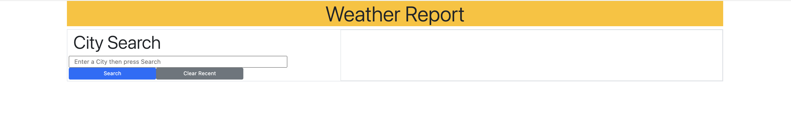
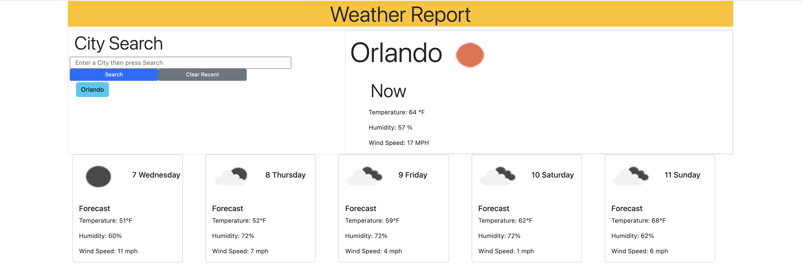
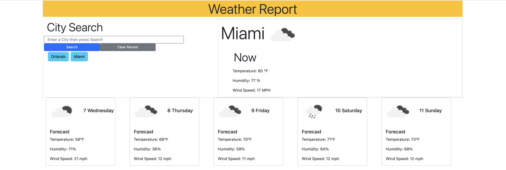
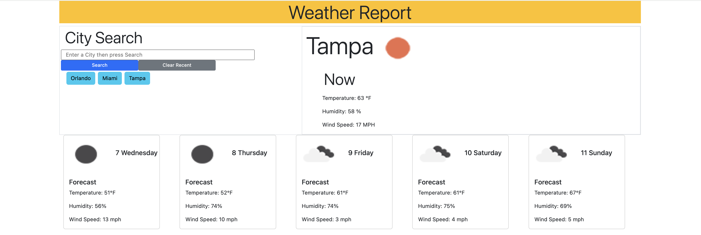
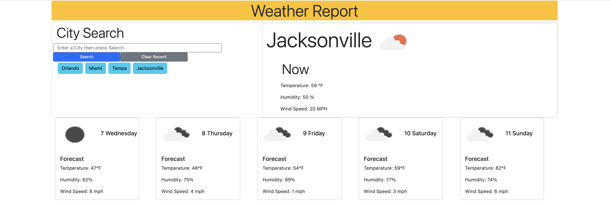

# Weather Dashboard

## Description

The Weather Dashboard is a dynamic web application that provides users with the weather outlook for multiple cities. Leveraging the [OpenWeather 5 Day Weather Forecast API](https://openweathermap.org/forecast5), this application offers current and future weather conditions, aiding travelers in planning their trips efficiently. Data persistence is achieved through `localStorage`, enabling a seamless user experience with a history of searched cities.

## Features

- **City Search**: Users can search for a city to retrieve current and future weather conditions.
- **Weather Details**: Displays the city name, date, weather conditions, temperature, humidity, and wind speed.
- **5-Day Forecast**: Shows a 5-day weather forecast with conditions, temperature, wind speed, and humidity.
- **Search History**: Maintains a clickable list of previously searched cities for easy access to their weather data.

## How to Use

1. **Search for a City**: Enter the name of a city in the search bar and press the search button or hit enter.
2. **View Weather Data**: The current weather conditions and a 5-day forecast for the searched city will be displayed.
3. **Utilize Search History**: Click on any city in the search history to quickly retrieve weather data for that location.
4. **Clear History**: Use the clear button to reset the search history and current weather displays.

## Screenshots

- 

- 

- 

- 

- 

## Try it Out!
[Click here to try it out!](https://mbarrie1979.github.io/Weather_Planner/)

## API Integration

This application uses the [OpenWeatherMap API](https://openweathermap.org/api) to fetch weather data. It requires an API key, which can be obtained by registering on the OpenWeatherMap website. The base URL for the API looks like this: `https://api.openweathermap.org/data/2.5/forecast?lat={lat}&lon={lon}&appid={API key}`.

## Local Storage

`localStorage` is used to store the search history, making it persistent across browser sessions. This allows the application to remember previously searched cities and display them as quick-access buttons.

## Dependencies

- jQuery for DOM manipulation and AJAX requests.
- Bootstrap for styling and responsive design.
- OpenWeatherMap API for weather data.

## Credits

Mark Barrie - Developer

## License

This project is open source and available under the [MIT License](LICENSE).
